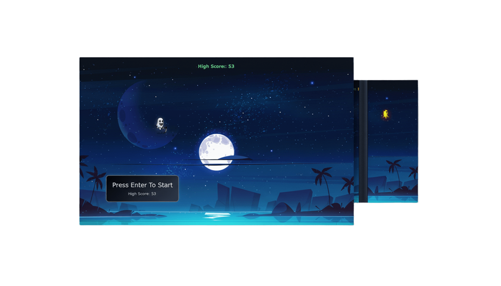

# GhostyWebpage

## About

### Problem Statement
In the ever-evolving landscape of web development, the need for projects that combine aesthetics with functionality is crucial. GhostyWebpage addresses this by providing a ghost-themed design that not only looks visually appealing but also offers an interactive and responsive user experience. This project serves as a showcase for modern web development techniques, ensuring that it is both educationally valuable and practically applicable.

### Target Audience
GhostyWebpage is designed for:
- Web developers seeking to enhance their skills in modern web development.
- Designers aiming to explore responsive design and interactive elements.
- Educators and students looking for a real-world example of web development best practices.

## Features

### UI/UX
- **Responsive Design**: The project is optimized to work seamlessly across all screen sizes, ensuring an excellent user experience on both desktop and mobile devices.
- **Interactive Elements**: Smooth animations and engaging user interactions that enhance the overall experience.
- **Modern Typography and Color Scheme**: A professional design that leverages the latest trends in web design for a clean and intuitive interface.

### Performance
- **Optimized CSS**: Utilizes SCSS for efficient styling and maintainability.
- **Efficient Asset Delivery**: Optimized images and CSS files to ensure fast loading times.
- **Lightweight JavaScript**: Minimal and efficient JavaScript implementation to enhance performance.

### Compatibility
- **Cross-Browser Support**: Tested and compatible with major browsers including Chrome, Firefox, Safari, and Edge.
- **Web Standards Compliance**: Adheres to the latest web standards for broader compatibility and future-proofing.

## Technologies

### Core Technologies
- **HTML5**: The foundation of the project, ensuring semantic and accessible markup.
- **SCSS (Sass)**: Enhances CSS with variables, nesting, mixins, and more for cleaner and more manageable stylesheets.
- **CSS3**: Leveraged for styling, with SCSS for enhanced organization and maintainability.
- **BootStrap**: Used for implementing interactive features and Responsive design.

### Tools & Libraries
- **VS Code**: The primary development environment, offering robust features for web development.
- **Live Sass Compiler**: Real-time compilation of SCSS files for instant feedback and efficiency.
- **Git**: Version control is managed using Git for tracking changes and facilitating collaboration.

## Getting Started

### Prerequisites
- Basic understanding of web development concepts.
- Familiarity with command-line interfaces for running scripts.
- A modern web browser for testing and viewing the project.

### Installation

1. **Clone the Repository**:
   ```bash
   git clone https://github.com/your-profile/GhostyWebpage.git
   ```

2. **Navigate to the Project Directory**:
   ```bash
   cd /home/aswin/programming/vscode/@web/GhostyWebpage
   ```

3. **Launch the Development Server**:
   ```bash
   python3 -m http.server 8000
   ```

4. **Open in Your Browser**:
   Visit `http://localhost:8000` to view the project.

## Screenshots

### Homepage

*A preview of the main landing page showcasing the ghost theme and responsive design.*

### Design Elements

*The project's logo, highlighting the professional typography and color scheme.*

## Contributing

We welcome contributions from the community to help improve and expand the capabilities of GhostyWebpage. Here's how you can get involved:

### How to Contribute

1. **Fork the Repository**:
   Create your own fork of the repository to work on your contributions.

2. **Create a Feature Branch**:
   ```
   git checkout -b feature/your-feature-name
   ```

3. **Commit Changes**:
   - Ensure your commit messages are clear and descriptive.
   - Follow the established coding standards and best practices.

4. **Push to Your Branch**:
   ```
   git push origin feature/your-feature-name
   ```

5. **Create a Pull Request**:
   Submit your changes for review and inclusion in the main branch.

### Coding Standards

- **Code Style**: Maintain consistency by following the existing code style and formatting.
- **Documentation**: Include thorough comments and documentation for any new features or significant changes.
- **Unit Tests**: Write unit tests for new features to ensure reliability and maintainability.

### Code of Conduct

By participating in this project, you agree to follow our Code of Conduct, which promotes respect, inclusion, and constructive collaboration.

## Changelog

### Version 1.0.0
- **Initial Release**: Core features implemented, including the responsive design and basic interactivity.
- **Basic Documentation**: Initial setup of the project documentation and README file.

### Version 1.1.0
- **Enhanced Responsive Design**: Improved support for various screen sizes and devices.
- **Asset Optimization**: Optimized images and CSS files for faster loading times.
- **Updated Documentation**: Expanded sections on contributing and installation for better user experience.

## License

This project is licensed under the MIT License, which allows for maximum flexibility and freedom in using and modifying the code. For detailed licensing information, please refer to the [LICENSE](LICENSE) file.

## Contact

For any questions, feedback, or contributions, please reach out via:

- **Email**: [aswinvishal402@gmail.com](mailto:aswinvishal402@gmail.com.com)
- **GitHub**: [aswin402](https://github.com/aswin402)

## Acknowledgments

We would like to express our gratitude to:

- The open-source community for the invaluable tools and libraries that have been instrumental in the development of this project.
- All contributors who have dedicated their time and effort to improve GhostyWebpage.
- The users who have provided feedback and helped shape the direction of the project.

---

By following these guidelines and contributing to GhostyWebpage, you help us build a robust, user-friendly, and visually appealing web application that sets a standard for modern web development.